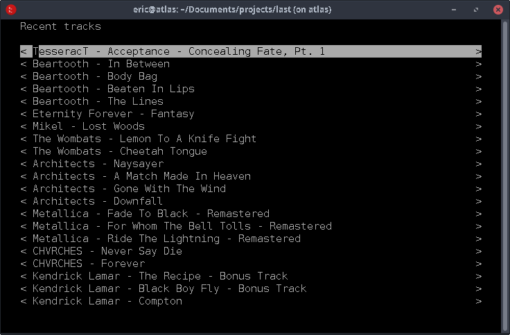

# Lastting

Title not final :bowtie: This is (going to be) a client for the [Last.fm](http://last.fm) API, designed to sit inside of a terminal window/tmux pane. Here's what it looks like at the moment: 



Currently it just grabs recent scrobbles and displays them in a scrollable list. 

## Testing

If you want to try it out, you'll need to register an API key [over here](
https://www.last.fm/api/account/create), then put your key in a `creds/creds.py` file along with a username like so:

```python
apikey = "KEY_HERE"
user = "recoilmoney"
```

## Features

- [x] data fetching (recent and top tracks)
- [x] scrollable list view
- [ ] auto-refreshing
- [ ] opening links in browser

